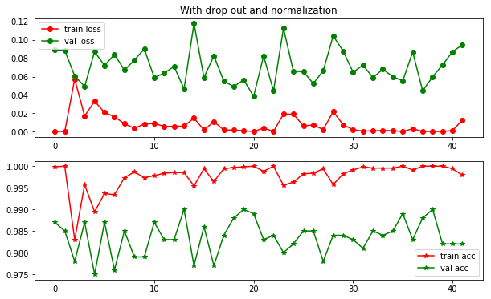

```python
import numpy as np
from sklearn.svm import SVC, LinearSVC
from sklearn.metrics import classification_report

import matplotlib.pyplot as plt

from datautils import loadData

from sklearn.metrics import confusion_matrix
from sklearn import metrics
```


```python
trainfilename = './data/train.csv'
testfilename = './data/test.csv'

train= loadData(trainfilename, shuffle=True, dtype='float32')
test = loadData(testfilename, shuffle=False, dtype='float32')
```


```python
datasize = train.shape[0]
valsize = 1000
trainsize = datasize - valsize
print('Train size:%d, validation size:%d' % (trainsize, valsize))

X_train, y_train, X_val, y_val = train[0:trainsize, 1:-1], np.int32(train[0:trainsize,-1]),\
                                train[trainsize:datasize, 1:-1], np.int32(train[trainsize:datasize,-1])
print("Train data shape:", X_train.shape)
print('Train label shape:', y_train.shape)
print("Val data shape:", X_val.shape)
print('Val label shape:', y_val.shape)
```

    Train size:6800, validation size:1000
    Train data shape: (6800, 4096)
    Train label shape: (6800,)
    Val data shape: (1000, 4096)
    Val label shape: (1000,)
    


```python
X_test = test[:, 1:]
print("Test data shape:", X_test.shape)
```

    Test data shape: (15600, 4096)
    

### predict and save submission
```python
y_test = np.int32(model.predict(X_test))

with open('data/modelselection.csv', 'w') as fresult:
    fresult.write('id,categories\n')
    for idx, category in enumerate(y_test):
        fresult.write('%d,%d\n' % (idx, category))
    fresult.flush()
```

### Normalize to (-1,1)


```python
mean = np.mean(X_train, axis=0)
scale = (np.max(X_train, axis=0)-np.min(X_train, axis=0))/2
# remove zero value
scale[scale<1e-3]=1
```


```python
X_train_std = (X_train - mean)/scale
X_val_std = (X_val - mean)/scale
```

### Which column is zero constant???


```python
print(np.argwhere(np.max(X_train, axis=0)-np.min(X_train, axis=0)==0))
print(np.argwhere(np.max(X_test, axis=0)-np.min(X_test, axis=0)==0))
```

    [[ 199]
     [2622]]
    [[ 199]
     [2622]]
    

### Remove the cols where value is always zero


```python
X_cleantrain = np.hstack([X_train[:,0:199],X_train[:,200:2662],X_train[:,2663:]])
X_cleantrain_std = np.hstack([X_train_std[:,0:199],X_train_std[:,200:2662],X_train_std[:,2663:]])
```


```python
print('after drop operation, the new data has shape:')
print(X_cleantrain.shape)
print(X_cleantrain_std.shape)
```

    after drop operation, the new data has shape:
    (6800, 4094)
    (6800, 4094)
    


```python
import time
```


```python
from sklearn.decomposition import PCA
```


```python
pca = PCA(n_components=2048)
```


```python
pca.fit(X_train)

X_train_new = pca.transform(X_train)
X_val_new = pca.transform(X_val)
```


    PCA(copy=True, iterated_power='auto', n_components=2048, random_state=None,
      svd_solver='auto', tol=0.0, whiten=False)


```python
pca_std = PCA(n_components=2048)
pca_std.fit(X_train_std)
X_train_new_std = pca_std.transform(X_train_std)
X_val_new_std = pca_std.transform(X_val_std)
```

## Logistic regression


```python
from sklearn.linear_model import LogisticRegression
```


```python
start = time.time()
logicmodel = LogisticRegression(C=0.4)
logicmodel.fit(X=X_train, y=y_train)
end = time.time()
print('use time', end - start)
```

    /home/mean/.local/lib/python3.5/site-packages/sklearn/linear_model/logistic.py:432: FutureWarning: Default solver will be changed to 'lbfgs' in 0.22. Specify a solver to silence this warning.
      FutureWarning)
    /home/mean/.local/lib/python3.5/site-packages/sklearn/linear_model/logistic.py:459: FutureWarning: Default multi_class will be changed to 'auto' in 0.22. Specify the multi_class option to silence this warning.
      "this warning.", FutureWarning)
    

    use time 17.571584701538086
    


```python
y_pred = logicmodel.predict(X_val)
print('accuracy:', np.mean(y_pred==y_val))
print(confusion_matrix(y_true=y_val, y_pred=y_pred))
print(metrics.classification_report(y_true=y_val, y_pred=y_pred))
```

    accuracy: 0.989
    [[88  0  0  0  0  0  0  0  0  0  0  1]
     [ 0 88  0  0  3  0  0  0  0  0  0  0]
     [ 0  0 78  0  0  0  0  0  0  0  0  0]
     [ 0  1  0 80  0  0  0  0  0  0  0  0]
     [ 0  1  0  0 92  0  0  0  0  0  0  0]
     [ 0  0  0  0  0 76  0  0  0  0  1  0]
     [ 0  0  0  0  0  0 75  0  0  0  0  0]
     [ 0  0  0  0  0  0  0 88  0  0  0  0]
     [ 0  0  0  1  0  0  0  0 80  1  0  0]
     [ 0  0  0  0  0  0  0  0  0 84  0  0]
     [ 0  0  0  0  0  0  0  0  0  0 90  0]
     [ 0  0  0  1  0  0  0  0  0  1  0 70]]
                  precision    recall  f1-score   support
    
               0       1.00      0.99      0.99        89
               1       0.98      0.97      0.97        91
               2       1.00      1.00      1.00        78
               3       0.98      0.99      0.98        81
               4       0.97      0.99      0.98        93
               5       1.00      0.99      0.99        77
               6       1.00      1.00      1.00        75
               7       1.00      1.00      1.00        88
               8       1.00      0.98      0.99        82
               9       0.98      1.00      0.99        84
              10       0.99      1.00      0.99        90
              11       0.99      0.97      0.98        72
    
       micro avg       0.99      0.99      0.99      1000
       macro avg       0.99      0.99      0.99      1000
    weighted avg       0.99      0.99      0.99      1000
    
    


```python
start = time.time()
logicmodel_std = LogisticRegression(C=0.4)
logicmodel_std.fit(X=X_train_std, y=y_train)
y_pred_std = logicmodel_std.predict(X_val_std)
end = time.time()
print('use time', end - start)
```

    /home/mean/.local/lib/python3.5/site-packages/sklearn/linear_model/logistic.py:432: FutureWarning: Default solver will be changed to 'lbfgs' in 0.22. Specify a solver to silence this warning.
      FutureWarning)
    /home/mean/.local/lib/python3.5/site-packages/sklearn/linear_model/logistic.py:459: FutureWarning: Default multi_class will be changed to 'auto' in 0.22. Specify the multi_class option to silence this warning.
      "this warning.", FutureWarning)
    

    use time 101.76495623588562
    


```python
print('accuracy:', np.mean(y_pred_std==y_val))
print(confusion_matrix(y_true=y_val, y_pred=y_pred_std))
print(metrics.classification_report(y_true=y_val, y_pred=y_pred_std))
```

    accuracy: 0.991
    [[88  0  0  0  0  0  0  0  0  0  0  1]
     [ 0 89  0  0  2  0  0  0  0  0  0  0]
     [ 0  0 78  0  0  0  0  0  0  0  0  0]
     [ 0  0  0 80  1  0  0  0  0  0  0  0]
     [ 0  0  0  0 93  0  0  0  0  0  0  0]
     [ 0  0  0  0  0 76  0  0  0  0  1  0]
     [ 0  0  0  0  0  0 75  0  0  0  0  0]
     [ 0  0  0  0  0  0  0 88  0  0  0  0]
     [ 0  0  0  0  0  0  0  0 81  1  0  0]
     [ 0  0  0  0  0  0  0  0  0 84  0  0]
     [ 0  0  1  0  0  0  0  0  0  0 89  0]
     [ 0  0  0  1  0  0  0  0  0  1  0 70]]
                  precision    recall  f1-score   support
    
               0       1.00      0.99      0.99        89
               1       1.00      0.98      0.99        91
               2       0.99      1.00      0.99        78
               3       0.99      0.99      0.99        81
               4       0.97      1.00      0.98        93
               5       1.00      0.99      0.99        77
               6       1.00      1.00      1.00        75
               7       1.00      1.00      1.00        88
               8       1.00      0.99      0.99        82
               9       0.98      1.00      0.99        84
              10       0.99      0.99      0.99        90
              11       0.99      0.97      0.98        72
    
       micro avg       0.99      0.99      0.99      1000
       macro avg       0.99      0.99      0.99      1000
    weighted avg       0.99      0.99      0.99      1000
    
    


```python
start = time.time()
logicmodel = LogisticRegression(C=0.4)
logicmodel.fit(X=X_train_new, y=y_train)
end = time.time()
print('use time', end - start)
```

    /home/mean/.local/lib/python3.5/site-packages/sklearn/linear_model/logistic.py:432: FutureWarning: Default solver will be changed to 'lbfgs' in 0.22. Specify a solver to silence this warning.
      FutureWarning)
    /home/mean/.local/lib/python3.5/site-packages/sklearn/linear_model/logistic.py:459: FutureWarning: Default multi_class will be changed to 'auto' in 0.22. Specify the multi_class option to silence this warning.
      "this warning.", FutureWarning)
    

    use time 117.95052337646484
    


```python
y_pred = logicmodel.predict(X_val_new)
print('accuracy:', np.mean(y_pred==y_val))
print(confusion_matrix(y_true=y_val, y_pred=y_pred))
print(metrics.classification_report(y_true=y_val, y_pred=y_pred))
```

    accuracy: 0.99
    [[88  0  0  0  0  0  0  0  0  0  0  1]
     [ 0 88  0  0  3  0  0  0  0  0  0  0]
     [ 0  0 78  0  0  0  0  0  0  0  0  0]
     [ 0  1  0 80  0  0  0  0  0  0  0  0]
     [ 1  1  0  0 91  0  0  0  0  0  0  0]
     [ 0  0  0  0  0 77  0  0  0  0  0  0]
     [ 0  0  0  0  0  0 75  0  0  0  0  0]
     [ 0  0  0  0  0  0  0 88  0  0  0  0]
     [ 0  0  0  0  0  0  0  0 81  1  0  0]
     [ 0  0  0  0  0  0  0  0  0 84  0  0]
     [ 0  0  0  0  0  0  0  0  0  0 90  0]
     [ 0  0  0  1  0  0  0  0  0  1  0 70]]
                  precision    recall  f1-score   support
    
               0       0.99      0.99      0.99        89
               1       0.98      0.97      0.97        91
               2       1.00      1.00      1.00        78
               3       0.99      0.99      0.99        81
               4       0.97      0.98      0.97        93
               5       1.00      1.00      1.00        77
               6       1.00      1.00      1.00        75
               7       1.00      1.00      1.00        88
               8       1.00      0.99      0.99        82
               9       0.98      1.00      0.99        84
              10       1.00      1.00      1.00        90
              11       0.99      0.97      0.98        72
    
       micro avg       0.99      0.99      0.99      1000
       macro avg       0.99      0.99      0.99      1000
    weighted avg       0.99      0.99      0.99      1000
    
    


```python

```


```python
start = time.time()
logicmodel_std = LogisticRegression(C=0.4)
logicmodel_std.fit(X=X_train_new_std, y=y_train)
end = time.time()
print('use time', end - start)
```

    /home/mean/.local/lib/python3.5/site-packages/sklearn/linear_model/logistic.py:432: FutureWarning: Default solver will be changed to 'lbfgs' in 0.22. Specify a solver to silence this warning.
      FutureWarning)
    /home/mean/.local/lib/python3.5/site-packages/sklearn/linear_model/logistic.py:459: FutureWarning: Default multi_class will be changed to 'auto' in 0.22. Specify the multi_class option to silence this warning.
      "this warning.", FutureWarning)
    

    use time 42.028701066970825
    


```python
y_pred_std = logicmodel_std.predict(X_val_new_std)
print('accuracy:', np.mean(y_pred_std==y_val))
print(confusion_matrix(y_true=y_val, y_pred=y_pred_std))
print(metrics.classification_report(y_true=y_val, y_pred=y_pred_std))
```

    accuracy: 0.989
    [[88  0  0  0  0  0  0  0  0  0  0  1]
     [ 0 88  0  0  3  0  0  0  0  0  0  0]
     [ 0  0 78  0  0  0  0  0  0  0  0  0]
     [ 0  0  0 80  1  0  0  0  0  0  0  0]
     [ 0  1  0  0 92  0  0  0  0  0  0  0]
     [ 0  0  0  0  0 76  0  0  0  0  1  0]
     [ 0  0  0  0  0  0 75  0  0  0  0  0]
     [ 0  0  0  0  0  0  0 88  0  0  0  0]
     [ 0  0  0  0  0  0  0  0 81  1  0  0]
     [ 0  0  0  0  0  0  0  0  0 84  0  0]
     [ 0  0  1  0  0  0  0  0  0  0 89  0]
     [ 0  0  0  1  0  0  0  0  0  1  0 70]]
                  precision    recall  f1-score   support
    
               0       1.00      0.99      0.99        89
               1       0.99      0.97      0.98        91
               2       0.99      1.00      0.99        78
               3       0.99      0.99      0.99        81
               4       0.96      0.99      0.97        93
               5       1.00      0.99      0.99        77
               6       1.00      1.00      1.00        75
               7       1.00      1.00      1.00        88
               8       1.00      0.99      0.99        82
               9       0.98      1.00      0.99        84
              10       0.99      0.99      0.99        90
              11       0.99      0.97      0.98        72
    
       micro avg       0.99      0.99      0.99      1000
       macro avg       0.99      0.99      0.99      1000
    weighted avg       0.99      0.99      0.99      1000
    
    

## Linear Regression


```python
from sklearn.linear_model import LinearRegression
```


```python
linearModel = LinearRegression(normalize=True)
```


```python
linearModel.fit(X_train,y_train)
```


    LinearRegression(copy_X=True, fit_intercept=True, n_jobs=None, normalize=True)


```python
y_pred = np.int32(linearModel.predict(X_val))
print('accuracy:', np.mean(y_pred==y_val))

print(confusion_matrix(y_true=y_val, y_pred=y_pred))
print(metrics.classification_report(y_true=y_val, y_pred=y_pred))
```

    accuracy: 0.286
    [[ 0  0  0  0  0  0  0  0  0  0  0  0  0  0  0  0  0  0  0  0]
     [ 0  0  0  0  0  0  0  0  0  0  0  0  0  0  0  0  0  0  0  0]
     [ 0  0  0  0  0  0  0  0  0  0  0  0  0  0  0  0  0  0  0  0]
     [ 0  0  0  0  0  0  0  0  0  0  0  0  0  0  0  0  0  0  0  0]
     [ 1  1  3  9 46 12  4  4  0  0  0  0  0  0  0  0  0  0  0  0]
     [ 0  0  0  2 28 24 23  9  3  3  0  0  0  0  0  0  0  0  0  0]
     [ 0  0  0  3 18 14 30 13  9  5  0  2  1  0  0  0  0  0  0  0]
     [ 0  0  0  0  5 12 30 22 12  3  1  2  1  1  1  0  0  0  0  0]
     [ 0  0  0  0  3  3 15 25 20 12  3  0  1  0  0  0  0  0  0  0]
     [ 0  0  0  0  0  0  7 11 14 23 14  1  1  0  0  0  0  0  0  0]
     [ 0  0  0  0  0  0  1  3 12 23 20  7  2  1  0  0  0  0  0  0]
     [ 0  0  0  0  0  0  0  0  5 15 18 28 13  2  2  0  0  0  0  0]
     [ 0  0  0  0  0  0  0  0  3  4 24 23 17 10  4  1  0  0  0  0]
     [ 0  0  0  0  0  0  0  0  2  1  9 10 19 23 11  5  4  0  0  0]
     [ 0  0  0  0  0  0  0  0  1  2  7 11 12 19 18  7  5  6  0  1]
     [ 0  0  0  0  0  0  0  0  1  0  1  4 10 17 14 15 11  3  1  2]
     [ 0  0  0  0  0  0  0  0  0  0  0  0  0  0  0  0  0  0  0  0]
     [ 0  0  0  0  0  0  0  0  0  0  0  0  0  0  0  0  0  0  0  0]
     [ 0  0  0  0  0  0  0  0  0  0  0  0  0  0  0  0  0  0  0  0]
     [ 0  0  0  0  0  0  0  0  0  0  0  0  0  0  0  0  0  0  0  0]]
                  precision    recall  f1-score   support
    
              -4       0.00      0.00      0.00         0
              -3       0.00      0.00      0.00         0
              -2       0.00      0.00      0.00         0
              -1       0.00      0.00      0.00         0
               0       0.46      0.57      0.51        80
               1       0.37      0.26      0.31        92
               2       0.27      0.32      0.29        95
               3       0.25      0.24      0.25        90
               4       0.24      0.24      0.24        82
               5       0.25      0.32      0.28        71
               6       0.21      0.29      0.24        69
               7       0.32      0.34      0.33        83
               8       0.22      0.20      0.21        86
               9       0.32      0.27      0.29        84
              10       0.36      0.20      0.26        89
              11       0.54      0.19      0.28        79
              12       0.00      0.00      0.00         0
              13       0.00      0.00      0.00         0
              14       0.00      0.00      0.00         0
              15       0.00      0.00      0.00         0
    
       micro avg       0.29      0.29      0.29      1000
       macro avg       0.19      0.17      0.17      1000
    weighted avg       0.32      0.29      0.29      1000
    
    

    /home/mean/.local/lib/python3.5/site-packages/sklearn/metrics/classification.py:1145: UndefinedMetricWarning: Recall and F-score are ill-defined and being set to 0.0 in labels with no true samples.
      'recall', 'true', average, warn_for)
    

## Perceptron Model


```python
# 训练感知机模型
from sklearn.linear_model import Perceptron
```

    
    


```python
# n_iter：可以理解成梯度下降中迭代的次数
# eta0：可以理解成梯度下降中的学习率
# random_state：设置随机种子的，为了每次迭代都有相同的训练集顺序
start = time.time()
perceptronmodel = Perceptron(n_iter=10, eta0=0.1, random_state=0)
perceptronmodel.fit(X_train, y_train)
end = time.time()
print('use time', end - start)
```

    /home/mean/.local/lib/python3.5/site-packages/sklearn/linear_model/stochastic_gradient.py:130: DeprecationWarning: n_iter parameter is deprecated in 0.19 and will be removed in 0.21. Use max_iter and tol instead.
      DeprecationWarning)
    

    use time 5.389361381530762
    


```python
# 分类测试集，这将返回一个测试结果的数组
y_pred = perceptronmodel.predict(X_val)
print('accuracy:', np.mean(y_pred==y_val))

print(confusion_matrix(y_true=y_val, y_pred=y_pred))
print(metrics.classification_report(y_true=y_val, y_pred=y_pred))
```

    accuracy: 0.987
    [[88  0  0  0  0  0  0  0  0  0  0  1]
     [ 0 90  0  0  1  0  0  0  0  0  0  0]
     [ 0  0 78  0  0  0  0  0  0  0  0  0]
     [ 0  1  0 80  0  0  0  0  0  0  0  0]
     [ 0  1  0  0 90  0  0  2  0  0  0  0]
     [ 0  0  0  0  0 76  0  0  0  0  0  1]
     [ 0  0  0  0  0  0 74  1  0  0  0  0]
     [ 0  0  0  0  0  0  0 88  0  0  0  0]
     [ 0  0  0  2  0  0  0  0 79  1  0  0]
     [ 0  0  0  0  0  0  0  0  0 83  0  1]
     [ 0  0  0  0  0  0  0  0  0  0 90  0]
     [ 0  0  0  1  0  0  0  0  0  0  0 71]]
                  precision    recall  f1-score   support
    
               0       1.00      0.99      0.99        89
               1       0.98      0.99      0.98        91
               2       1.00      1.00      1.00        78
               3       0.96      0.99      0.98        81
               4       0.99      0.97      0.98        93
               5       1.00      0.99      0.99        77
               6       1.00      0.99      0.99        75
               7       0.97      1.00      0.98        88
               8       1.00      0.96      0.98        82
               9       0.99      0.99      0.99        84
              10       1.00      1.00      1.00        90
              11       0.96      0.99      0.97        72
    
       micro avg       0.99      0.99      0.99      1000
       macro avg       0.99      0.99      0.99      1000
    weighted avg       0.99      0.99      0.99      1000
    
    


```python
start = time.time()
perceptronmodel = Perceptron(n_iter=30, eta0=0.1, random_state=0)
perceptronmodel.fit(X=X_train_new, y=y_train)
end = time.time()
print('use time', end - start)
y_pred_std = perceptronmodel.predict(X_val_new)
print('accuracy:', np.mean(y_pred_std==y_val))
```

    /home/mean/.local/lib/python3.5/site-packages/sklearn/linear_model/stochastic_gradient.py:130: DeprecationWarning: n_iter parameter is deprecated in 0.19 and will be removed in 0.21. Use max_iter and tol instead.
      DeprecationWarning)
    

    use time 5.797987222671509
    accuracy: 0.985
    


```python
start = time.time()
perceptronmodel_std = Perceptron(n_iter=30, eta0=0.1, random_state=0)
perceptronmodel_std.fit(X=X_train_new_std, y=y_train)
end = time.time()
print('use time', end - start)
y_pred_std = perceptronmodel_std.predict(X_val_new_std)
print('accuracy:', np.mean(y_pred_std==y_val))
```

    /home/mean/.local/lib/python3.5/site-packages/sklearn/linear_model/stochastic_gradient.py:130: DeprecationWarning: n_iter parameter is deprecated in 0.19 and will be removed in 0.21. Use max_iter and tol instead.
      DeprecationWarning)
    

    use time 7.129545450210571
    accuracy: 0.989
    


```python

```


```python

```


```python

```


```python
start = time.time()
perceptronmodel_std = Perceptron(n_iter=50, eta0=0.01, random_state=0)
perceptronmodel_std.fit(X_train_std, y_train)
end = time.time()
print('use time', end - start)
```

    /home/mean/.local/lib/python3.5/site-packages/sklearn/linear_model/stochastic_gradient.py:130: DeprecationWarning: n_iter parameter is deprecated in 0.19 and will be removed in 0.21. Use max_iter and tol instead.
      DeprecationWarning)
    

    use time 19.838786125183105
    


```python
# 分类测试集，这将返回一个测试结果的数组
y_pred_std = perceptronmodel_std.predict(X_val_std)
print('accuracy:', np.mean(y_pred_std==y_val))

print(confusion_matrix(y_true=y_val, y_pred=y_pred_std))
print(metrics.classification_report(y_true=y_val, y_pred=y_pred_std))
```

    accuracy: 0.988
    [[89  0  0  0  0  0  0  0  0  0  0  0]
     [ 0 89  0  0  2  0  0  0  0  0  0  0]
     [ 0  0 78  0  0  0  0  0  0  0  0  0]
     [ 0  0  0 80  1  0  0  0  0  0  0  0]
     [ 1  0  0  0 92  0  0  0  0  0  0  0]
     [ 0  0  0  0  0 76  0  1  0  0  0  0]
     [ 0  0  0  0  0  0 75  0  0  0  0  0]
     [ 0  1  0  0  0  0  0 86  0  0  1  0]
     [ 0  0  0  1  0  0  0  0 81  0  0  0]
     [ 0  0  0  0  0  0  0  0  0 82  2  0]
     [ 0  0  0  0  0  0  0  0  0  0 89  1]
     [ 0  0  0  1  0  0  0  0  0  0  0 71]]
                  precision    recall  f1-score   support
    
               0       0.99      1.00      0.99        89
               1       0.99      0.98      0.98        91
               2       1.00      1.00      1.00        78
               3       0.98      0.99      0.98        81
               4       0.97      0.99      0.98        93
               5       1.00      0.99      0.99        77
               6       1.00      1.00      1.00        75
               7       0.99      0.98      0.98        88
               8       1.00      0.99      0.99        82
               9       1.00      0.98      0.99        84
              10       0.97      0.99      0.98        90
              11       0.99      0.99      0.99        72
    
       micro avg       0.99      0.99      0.99      1000
       macro avg       0.99      0.99      0.99      1000
    weighted avg       0.99      0.99      0.99      1000
    
    

### use SVM


```python
start = time.time()
svmmodel = LinearSVC(C=0.7)
#model.fit(train[:,1:-1], train[:,-1])
svmmodel.fit(X_train, y_train)
end = time.time()
print('use time', end - start)
```

    use time 1.9447283744812012
    


```python
y_pred = svmmodel.predict(X_val)
print('accuracy:', np.mean(y_pred==y_val))

print(confusion_matrix(y_true=y_val, y_pred=y_pred))
print(metrics.classification_report(y_true=y_val, y_pred=y_pred))
```

    accuracy: 0.99
    [[88  0  0  0  0  0  0  0  0  0  0  1]
     [ 0 89  0  0  2  0  0  0  0  0  0  0]
     [ 0  0 78  0  0  0  0  0  0  0  0  0]
     [ 0  1  0 80  0  0  0  0  0  0  0  0]
     [ 0  1  0  0 92  0  0  0  0  0  0  0]
     [ 0  0  0  0  0 76  0  0  0  0  1  0]
     [ 0  0  0  0  0  0 75  0  0  0  0  0]
     [ 0  0  0  0  0  0  0 88  0  0  0  0]
     [ 0  0  0  1  0  0  0  0 80  1  0  0]
     [ 0  0  0  0  0  0  0  0  0 84  0  0]
     [ 0  0  0  0  0  0  0  0  0  0 90  0]
     [ 0  0  0  1  0  0  0  0  0  1  0 70]]
                  precision    recall  f1-score   support
    
               0       1.00      0.99      0.99        89
               1       0.98      0.98      0.98        91
               2       1.00      1.00      1.00        78
               3       0.98      0.99      0.98        81
               4       0.98      0.99      0.98        93
               5       1.00      0.99      0.99        77
               6       1.00      1.00      1.00        75
               7       1.00      1.00      1.00        88
               8       1.00      0.98      0.99        82
               9       0.98      1.00      0.99        84
              10       0.99      1.00      0.99        90
              11       0.99      0.97      0.98        72
    
       micro avg       0.99      0.99      0.99      1000
       macro avg       0.99      0.99      0.99      1000
    weighted avg       0.99      0.99      0.99      1000
    
    


```python
start = time.time()
svmmodel_std = LinearSVC(C=0.7)
svmmodel_std.fit(X_train_std, y_train)
end = time.time()
print('use time', end - start)
```

    use time 13.40217137336731
    


```python
y_pred_std = svmmodel_std.predict(X_val_std)
print('accuracy:', np.mean(y_pred_std==y_val))

print(confusion_matrix(y_true=y_val, y_pred=y_pred_std))
print(metrics.classification_report(y_true=y_val, y_pred=y_pred_std))
```

    accuracy: 0.99
    [[88  0  0  0  0  0  0  0  0  0  0  1]
     [ 0 89  0  0  2  0  0  0  0  0  0  0]
     [ 0  0 78  0  0  0  0  0  0  0  0  0]
     [ 0  1  0 80  0  0  0  0  0  0  0  0]
     [ 0  1  0  0 92  0  0  0  0  0  0  0]
     [ 0  0  0  0  0 77  0  0  0  0  0  0]
     [ 0  0  0  0  0  0 75  0  0  0  0  0]
     [ 0  0  0  0  0  0  0 88  0  0  0  0]
     [ 0  0  0  0  0  0  0  0 81  1  0  0]
     [ 0  0  0  0  0  0  0  0  0 83  0  1]
     [ 0  0  1  1  0  0  0  0  0  0 88  0]
     [ 0  0  0  1  0  0  0  0  0  0  0 71]]
                  precision    recall  f1-score   support
    
               0       1.00      0.99      0.99        89
               1       0.98      0.98      0.98        91
               2       0.99      1.00      0.99        78
               3       0.98      0.99      0.98        81
               4       0.98      0.99      0.98        93
               5       1.00      1.00      1.00        77
               6       1.00      1.00      1.00        75
               7       1.00      1.00      1.00        88
               8       1.00      0.99      0.99        82
               9       0.99      0.99      0.99        84
              10       1.00      0.98      0.99        90
              11       0.97      0.99      0.98        72
    
       micro avg       0.99      0.99      0.99      1000
       macro avg       0.99      0.99      0.99      1000
    weighted avg       0.99      0.99      0.99      1000
    
    


```python
start = time.time()
svmmodel = LinearSVC(C=0.8)
svmmodel.fit(X_train_new, y_train)
end = time.time()
print('use time', end - start)

y_pred = svmmodel.predict(X_val_new)
print('accuracy:', np.mean(y_pred==y_val))
```

    use time 30.23509168624878
    accuracy: 0.992
    


```python
start = time.time()
svmmodel_std = LinearSVC(C=0.8)
svmmodel_std.fit(X_train_new_std, y_train)
end = time.time()
print('use time', end - start)

y_pred = svmmodel_std.predict(X_val_new_std)
print('accuracy:', np.mean(y_pred==y_val))
```

    use time 6.04499888420105
    accuracy: 0.99
    


```python

```

## SVM

```python
from sklearn import model_selection
from sklearn.svm import LinearSVR, LinearSVC, SVC

seed = 7
kfold = model_selection.KFold(n_splits=10, random_state=seed)
model = LinearSVC()
model.fit(X_train, y_train)
```

```python
y_pred = model.predict(X_val)
print('accuracy:', np.mean(y_pred==y_val))
print(confusion_matrix(y_true=y_val, y_pred=y_pred))
print(metrics.classification_report(y_true=y_val, y_pred=y_pred))
```
```
accuracy: 0.989
[[84  0  0  0  0  0  0  0  0  0  0  0]
 [ 0 98  0  0  0  0  0  0  0  0  0  0]
 [ 0  0 67  0  0  0  0  0  0  0  0  1]
 [ 0  0  0 81  0  0  0  0  2  0  0  1]
 [ 1  1  0  0 86  0  0  0  0  0  0  0]
 [ 0  0  0  0  0 79  1  0  0  0  0  0]
 [ 0  0  0  0  0  0 79  0  0  0  0  0]
 [ 0  0  0  0  0  0  0 80  0  0  0  0]
 [ 0  0  0  0  0  0  0  0 91  1  0  0]
 [ 0  0  0  0  0  0  0  0  1 82  1  0]
 [ 0  0  0  0  0  0  0  0  0  0 83  0]
 [ 0  0  0  0  0  1  0  0  0  0  0 79]]
 ```
              precision    recall  f1-score   support

           0       0.99      1.00      0.99        84
           1       0.99      1.00      0.99        98
           2       1.00      0.99      0.99        68
           3       1.00      0.96      0.98        84
           4       1.00      0.98      0.99        88
           5       0.99      0.99      0.99        80
           6       0.99      1.00      0.99        79
           7       1.00      1.00      1.00        80
           8       0.97      0.99      0.98        92
           9       0.99      0.98      0.98        84
          10       0.99      1.00      0.99        83
          11       0.98      0.99      0.98        80
```
   micro avg       0.99      0.99      0.99      1000
   macro avg       0.99      0.99      0.99      1000
weighted avg       0.99      0.99      0.99      1000
```

## ada boost


```python
from sklearn.ensemble import AdaBoostClassifier
```


```python
start = time.time()
model = AdaBoostClassifier(base_estimator=None, n_estimators=80, 
                           learning_rate=0.1, algorithm='SAMME.R', 
                           random_state=None)
model.fit(X_train, y_train)
end = time.time()
print('use time', end - start)
```

    use time 117.15471696853638
    


```python
y_pred = model.predict(X_val)
print('accuracy:', np.mean(y_pred==y_val))

print(confusion_matrix(y_true=y_val, y_pred=y_pred))
print(metrics.classification_report(y_true=y_val, y_pred=y_pred))
```

    accuracy: 0.732
    [[81  0  0  0  3  1  0  0  0  0  3  1]
     [ 0 67  0  0 22  0  0  0  0  0  2  0]
     [ 0  0 61  0  0  0  0  0  0  0 17  0]
     [ 0  0  0 69  1  0  0  0  0  0 11  0]
     [ 1  0  0  0 84  0  0  0  0  1  7  0]
     [ 0  0  0  0  2 56  0  0  0  0 19  0]
     [ 0  0  0  0  0 10 29  0  0  0 36  0]
     [ 0  0  2  0  2  0  0 64  0  0 20  0]
     [ 0  0  0 51  0  0  0  0 20  2  9  0]
     [ 0  0  0  0  0  0  0  0  0 71 13  0]
     [ 0  0  0  0  0  0  0  0  0  1 89  0]
     [ 0  0  0  0  0  0  0  0  0  2 29 41]]
                  precision    recall  f1-score   support
    
               0       0.99      0.91      0.95        89
               1       1.00      0.74      0.85        91
               2       0.97      0.78      0.87        78
               3       0.57      0.85      0.69        81
               4       0.74      0.90      0.81        93
               5       0.84      0.73      0.78        77
               6       1.00      0.39      0.56        75
               7       1.00      0.73      0.84        88
               8       1.00      0.24      0.39        82
               9       0.92      0.85      0.88        84
              10       0.35      0.99      0.52        90
              11       0.98      0.57      0.72        72
    
       micro avg       0.73      0.73      0.73      1000
       macro avg       0.86      0.72      0.74      1000
    weighted avg       0.86      0.73      0.74      1000
    
    


```python
start = time.time()
adaboost_std = AdaBoostClassifier(base_estimator=None, n_estimators=80, 
                           learning_rate=0.01, algorithm='SAMME.R', 
                           random_state=None)
adaboost_std.fit(X_train_std, y_train)
end = time.time()
print('use time', end - start)
```

    use time 111.33778786659241
    


```python
y_pred_std = adaboost_std.predict(X_val_std)
print('accuracy:', np.mean(y_pred_std==y_val))

print(confusion_matrix(y_true=y_val, y_pred=y_pred_std))
print(metrics.classification_report(y_true=y_val, y_pred=y_pred_std))
```

    accuracy: 0.717
    [[80  0  1  0  1  1  0  0  0  0  6  0]
     [ 0  2  0  1 86  0  0  0  1  0  1  0]
     [ 0  0 61  0  3  0  1  0  0  1 12  0]
     [ 0  0  0 57  1  0  0  0 17  3  3  0]
     [ 0  1  0  0 89  0  0  0  0  1  2  0]
     [ 7  0  1  0  4 56  1  0  0  0  7  1]
     [ 1  0  0  1  0  3 64  0  0  0  5  1]
     [ 0  0  1  0  6  0  0 65  0  0  4 12]
     [ 0  0  0  7  1  0  0  0 63 10  1  0]
     [ 0  1  2  0  1  1  0  0  1 63 12  3]
     [ 0  0  2  1  2  1  0  0  0  1 62 21]
     [ 0  0  1  0  2  1  2  0  0  3  8 55]]
                  precision    recall  f1-score   support
    
               0       0.91      0.90      0.90        89
               1       0.50      0.02      0.04        91
               2       0.88      0.78      0.83        78
               3       0.85      0.70      0.77        81
               4       0.45      0.96      0.62        93
               5       0.89      0.73      0.80        77
               6       0.94      0.85      0.90        75
               7       1.00      0.74      0.85        88
               8       0.77      0.77      0.77        82
               9       0.77      0.75      0.76        84
              10       0.50      0.69      0.58        90
              11       0.59      0.76      0.67        72
    
       micro avg       0.72      0.72      0.72      1000
       macro avg       0.76      0.72      0.71      1000
    weighted avg       0.75      0.72      0.70      1000
    
    


```python

```


```python

```

## decision tree


```python
from sklearn.tree import DecisionTreeClassifier
```


```python
start = time.time()
treemodel = DecisionTreeClassifier(criterion='entropy')
treemodel.fit(X_train, y_train)
end = time.time()
print('use time', end - start)
```

    use time 29.129443407058716
    


```python
y_pred = treemodel.predict(X_val)
print('accuracy:', np.mean(y_pred==y_val))

print(confusion_matrix(y_true=y_val, y_pred=y_pred))
print(metrics.classification_report(y_true=y_val, y_pred=y_pred))
```

    accuracy: 0.897
    [[83  0  1  1  0  1  0  0  0  0  1  2]
     [ 0 82  0  0  6  0  0  0  1  1  0  1]
     [ 0  0 66  1  0  1  0  0  0  4  4  2]
     [ 0  1  0 74  0  0  0  0  6  0  0  0]
     [ 1  6  0  0 80  0  1  1  0  2  2  0]
     [ 1  0  2  1  0 73  0  0  0  0  0  0]
     [ 0  0  2  0  1  2 66  1  1  0  2  0]
     [ 0  0  0  1  2  0  0 84  0  0  1  0]
     [ 1  0  1  6  0  0  0  0 72  2  0  0]
     [ 1  0  3  3  0  0  0  0  1 73  1  2]
     [ 2  0  0  1  0  3  2  0  1  1 79  1]
     [ 0  0  0  1  1  1  1  0  0  3  0 65]]
                  precision    recall  f1-score   support
    
               0       0.93      0.93      0.93        89
               1       0.92      0.90      0.91        91
               2       0.88      0.85      0.86        78
               3       0.83      0.91      0.87        81
               4       0.89      0.86      0.87        93
               5       0.90      0.95      0.92        77
               6       0.94      0.88      0.91        75
               7       0.98      0.95      0.97        88
               8       0.88      0.88      0.88        82
               9       0.85      0.87      0.86        84
              10       0.88      0.88      0.88        90
              11       0.89      0.90      0.90        72
    
       micro avg       0.90      0.90      0.90      1000
       macro avg       0.90      0.90      0.90      1000
    weighted avg       0.90      0.90      0.90      1000
    
    


```python

```


```python
start = time.time()
treemodel_std = DecisionTreeClassifier(criterion='gini')
treemodel_std.fit(X_train_std, y_train)
end = time.time()
print('use time', end - start)
```

    use time 11.572425842285156
    


```python
y_pred_std = treemodel_std.predict(X_val_std)
print('accuracy:', np.mean(y_pred_std==y_val))

print(confusion_matrix(y_true=y_val, y_pred=y_pred_std))
print(metrics.classification_report(y_true=y_val, y_pred=y_pred_std))
```

    accuracy: 0.889
    [[86  0  2  0  0  0  0  0  0  1  0  0]
     [ 0 82  0  0  5  0  0  0  2  0  0  2]
     [ 1  0 65  2  1  0  2  1  0  2  1  3]
     [ 0  0  0 68  1  1  0  1  5  0  5  0]
     [ 0  3  0  0 86  0  0  3  0  1  0  0]
     [ 0  0  0  0  3 68  1  2  0  0  2  1]
     [ 0  0  1  1  0  2 69  0  0  2  0  0]
     [ 2  0  3  0  2  0  0 80  0  0  1  0]
     [ 0  0  1  4  1  0  1  1 70  2  1  1]
     [ 1  0  4  0  1  0  0  0  0 72  4  2]
     [ 0  0  3  0  2  0  0  0  0  3 81  1]
     [ 2  0  3  0  0  0  1  0  0  2  2 62]]
                  precision    recall  f1-score   support
    
               0       0.93      0.97      0.95        89
               1       0.96      0.90      0.93        91
               2       0.79      0.83      0.81        78
               3       0.91      0.84      0.87        81
               4       0.84      0.92      0.88        93
               5       0.96      0.88      0.92        77
               6       0.93      0.92      0.93        75
               7       0.91      0.91      0.91        88
               8       0.91      0.85      0.88        82
               9       0.85      0.86      0.85        84
              10       0.84      0.90      0.87        90
              11       0.86      0.86      0.86        72
    
       micro avg       0.89      0.89      0.89      1000
       macro avg       0.89      0.89      0.89      1000
    weighted avg       0.89      0.89      0.89      1000
    
    


```python
start = time.time()
treemodel_std = DecisionTreeClassifier(criterion='gini')
treemodel_std.fit(X_train_new_std, y_train)
end = time.time()
print('use time', end - start)

y_pred_std = treemodel_std.predict(X_val_new_std)
print('accuracy:', np.mean(y_pred_std==y_val))
```

    use time 19.271950006484985
    accuracy: 0.938
    


```python
start = time.time()
treemodel_std = DecisionTreeClassifier(criterion='entropy')
treemodel_std.fit(X_train_new_std, y_train)
end = time.time()
print('use time', end - start)

y_pred_std = treemodel_std.predict(X_val_new_std)
print('accuracy:', np.mean(y_pred_std==y_val))
```

    use time 50.49819326400757
    accuracy: 0.944
    


```python
start = time.time()
treemodel = DecisionTreeClassifier(criterion='entropy')
treemodel.fit(X_train_new, y_train)
end = time.time()
print('use time', end - start)

y_pred_std = treemodel.predict(X_val_new)
print('accuracy:', np.mean(y_pred_std==y_val))
```

    use time 54.977537631988525
    accuracy: 0.934
    


```python
start = time.time()
treemodel = DecisionTreeClassifier(criterion='gini')
treemodel.fit(X_train_new, y_train)
end = time.time()
print('use time', end - start)

y_pred_std = treemodel.predict(X_val_new)
print('accuracy:', np.mean(y_pred_std==y_val))
```

    use time 17.98073935508728
    accuracy: 0.936
    


```python

```

## Visualization


```python
classes = [0,1,2,3,4,5,6,7,8,9,10,11]
num_classes = len(classes)
samples_per_class = 7
plt.figure(figsize=(16,10))
for y, cls in enumerate(classes):
    idxs = np.flatnonzero(y_train == y)
    idxs = np.random.choice(idxs, samples_per_class, replace=False)
    for i, idx in enumerate(idxs):
        plt_idx = i * num_classes + y + 1
        plt.subplot(samples_per_class, num_classes, plt_idx)
        plt.imshow(X_train[idx].reshape(64,64).astype('uint8'), cmap='gray')
        plt.axis('off')
        if i == 0:
            plt.title(cls)
plt.show()
```


```python
from sklearn.decomposition import PCA
```


```python
X_mean = np.mean(X_train, axis=0)
X_var = np.var(X_train, axis=0)

X_normtrain = (X_train - X_mean)/(X_var+1e-7)
```


```python
pca = PCA(n_components=2)
```


```python
pca.fit(X_normtrain)
```


    PCA(copy=True, iterated_power='auto', n_components=2, random_state=None,
      svd_solver='auto', tol=0.0, whiten=False)


```python
print(pca.explained_variance_)
print(pca.explained_variance_ratio_)
```

    [1250897.1  740694.7]
    [0.47487974 0.2811909 ]
    


```python
with open('axis2.csv', 'w') as faxis:
    for i in range(X_new.shape[0]):
        faxis.write('%f,%f,%d\n' %(X_new[i,0], X_new[i,1], y_train[i]))
```


```python
X_new = pca.transform(X_train)
plt.scatter(X_new[:, 0], X_new[:, 1],marker='.', c='r')
plt.show()
```


```python
pca.fit(X_train)
print(pca.explained_variance_)
print(pca.explained_variance_ratio_)
```

    [143.18799 112.49717]
    [0.0790835 0.0621328]
    


```python
X_new = pca.transform(X_train)
plt.scatter(X_new[:, 0], X_new[:, 1],marker='.')
plt.show()
```


```python
classes = [0,1,2,3,4,5,6,7,8,9,10,11]
colors = ['red', 'blue', 'green', 'tomato', 'orange', 'gray', 'skyblue', 'silver', 'purple', 'hotpink', 'navy', 'gold']
for i in [0,1,2,3]:
    #plt.subplot(2,2,i+1)
    plt.figure()
    for cls in classes[3*i:3*(i+1)]:
        idxs = np.flatnonzero(y_train == cls)
        plt.scatter(X_new[idxs, 0], X_new[idxs, 1],marker='.', c=colors[cls], label='class#'+str(cls))
        plt.legend()
    plt.title("dim reduction using PCA")
    plt.xlabel('feature 1')
    plt.ylabel('feature 2')
    plt.savefig('dimdeductin_%d.png'%(i))
    plt.show()
```


```python
classes = [0,1,2,3,4,5,6,7,8,9,10,11]
colors = ['red', 'blue', 'green', 'tomato', 'orange', 'gray', 'skyblue', 'silver', 'purple', 'hotpink', 'navy', 'gold']
plt.figure()
for cls in classes:
    idxs = np.flatnonzero(y_train == cls)
    plt.scatter(X_new[idxs, 0], X_new[idxs, 1],marker='.', c=colors[cls], label='class#'+str(cls))
    plt.legend()
plt.title("dim reduction using PCA")
plt.xlabel('feature 1')
plt.ylabel('feature 2')
plt.savefig('dimdeductin_all.png')
plt.show()
```


## 3dimenson


```python
from mpl_toolkits.mplot3d import Axes3D
```


```python
pca = PCA(n_components=3)
pca.fit(X_train)
X_new = pca.transform(X_train)

print(pca.explained_variance_)
print(pca.explained_variance_ratio_)
```

    [143.18787  112.49723   90.906906]
    [0.07908345 0.06213284 0.05020839]
    


```python
with open('axis.csv', 'w') as faxis:
    for i in range(X_new.shape[0]):
        faxis.write('%f,%f,%f,%d\n' %(X_new[i,0], X_new[i,1], X_new[i,2], y_train[i]))
```


```python

```


```python

```


```python
classes = [0,1,2,3,4,5,6,7,8,9,10,11]
colors = ['red', 'blue', 'green', 'tomato', 'orange', 'gray', 'skyblue', 'silver', 'purple', 'hotpink', 'navy', 'gold']

fig = plt.figure(figsize=(8, 5))
ax = Axes3D(fig, elev=30, azim=30)
for y, cls in enumerate(classes):
    idxs = np.flatnonzero(y_train == y)
    plt.scatter(X_new[idxs, 0], X_new[idxs, 1], X_new[idxs, 2],marker='.', c=colors[y], label=str(y))

plt.show()
```

    /home/michael/.local/lib/python3.6/site-packages/matplotlib/collections.py:874: RuntimeWarning: invalid value encountered in sqrt
      scale = np.sqrt(self._sizes) * dpi / 72.0 * self._factor
    


```python
X = np.concatenate([X_train, X_test])
Y = np.concatenate([y_train, y_test])

clf = LinearSVC(C=0.4)
clf.fit(X, Y)

y_pred = clf.predict(X_test)
print(classification_report(y_test,y_pred))
```


```python

```


```python

```


```python

```


```python

```


```python
import torch
import torch.nn as nn
import torch.functional as F
from torchvision import datasets, transforms
```


```python
from datautils import loadData
import numpy as np
import matplotlib.pyplot as plt
```

trainfilename = './data/train.csv'
testfilename = './data/test.csv'

train= loadData(trainfilename, shuffle=True, dtype='float32')
test = loadData(testfilename, shuffle=False, dtype='float32')

datasize = train.shape[0]
valsize = 1000
trainsize = datasize - valsize
print('Train size:%d, validation size:%d' % (trainsize, valsize))

X_train, y_train, X_val, y_val = train[0:trainsize, 1:-1], np.longlong(train[0:trainsize,-1]), train[trainsize:datasize, 1:-1], np.longlong(train[trainsize:datasize,-1])
print("Train data shape:", X_train.shape)
print('Train label shape:', y_train.shape)
print("Val data shape:", X_val.shape)
print('Val label shape:', y_val.shape)


```python
X_trainT, y_trainT = torch.from_numpy(X_train), torch.LongTensor(y_train)
X_valT, y_valT = torch.from_numpy(X_val), torch.LongTensor(y_val)
```


```python
X_trainT_std, y_trainT = torch.from_numpy(X_train_std), torch.LongTensor(y_train)
X_valT_std, y_valT = torch.from_numpy(X_val_std), torch.LongTensor(y_val)
```


```python
def weight_init(m):
    classname = m.__class__.__name__
    if classname.find('Linear') != -1:
        torch.nn.init.normal_(m.weight.data, 0.0, 0.02)
    elif classname.find('BatchNorm') != -1:
        torch.nn.init.normal_(m.weight.data, 1.0, 0.02)
        torch.nn.init.constant_(m.bias.data, 0)

def saveEvaluationResults(input, filename=""):
    with open(filename, 'w') as fresult:
        fresult.write('id,categories\n')
        for idx, category in enumerate(input):
            fresult.write('%d,%d\n' % (idx, category))
        fresult.flush()
```


```python
class DNN(nn.Module):
    def __init__(self, Hidden1, Hidden2):
        super(DNN, self).__init__()
        self.f = nn.Sequential(
            nn.Linear(4096, Hidden1),
            nn.BatchNorm1d(Hidden1),
            nn.Dropout(0.2),
            nn.ReLU(),
            nn.Linear(Hidden1, Hidden2),
            nn.Dropout(0.2),
            nn.BatchNorm1d(Hidden2),
            nn.ReLU(),
            nn.Linear(Hidden2, 12),
            #nn.Sigmoid() # it will cost you too much time
        )
        
    def forward(self, x):
        out = self.f(x)
        return out
```


```python
device = torch.device('cuda' if torch.cuda.is_available() else 'cpu')
print("use device:", device)

batch_size = 64
num_epochs = 40
learning_rate = 0.001


model = DNN(Hidden1=8192, Hidden2=4096).to(device)
model.apply(weight_init)
loss_func = torch.nn.CrossEntropyLoss()
optimizer = torch.optim.Adam(model.parameters(), lr=learning_rate)
```

    use device: cuda
    


```python
train_loss = []
train_acc = []
val_loss = []
val_acc = []
```


```python
train_loss.clear
train_acc.clear
val_loss.clear
val_acc.clear
# to cuda
X_trainT, y_trainT = X_trainT_std.to(device), y_trainT.to(device) # or you can change it to X_trainT when without normalization
X_valT, y_valT = X_valT_std.to(device), y_valT.to(device)

for epoch in range(num_epochs):
    model.train()
    iters = int(trainsize/batch_size)
    # ------ train loops -------
    for i in range(iters):
        sample_index = np.random.choice(trainsize, batch_size)
        X, Y = X_trainT[sample_index], y_trainT[sample_index]
        #X, Y = X.to(device), Y.to(device)
        optimizer.zero_grad()
        outputs = model(X)
        #y_pred = torch.argmax(outputs, dim=1)
        
        loss = loss_func(outputs, Y)
        loss.backward()
        optimizer.step()

        if i % 53 == 0:
            print('Epoch [%d/%d], Iter [%d/%d] Loss: %f'
                  % (epoch + 1, num_epochs, i, iters, loss.item()))
  
    
    # ------ evaluate -------
    X, Y = X_valT, y_valT
    #X, Y = X.to(device), Y.to(device)
    outputs = model(X)
    y_pred = torch.argmax(outputs, dim=1)
    loss = loss_func(outputs, Y)
    correct = (y_pred == Y).sum().item()
    total = X.size(0)
    # update training logs
    val_loss.append(loss.item())
    val_acc.append(correct/total)
    
    X, Y = X_trainT, y_trainT
    outputs = model(X)
    y_pred = torch.argmax(outputs, dim=1)
    loss = loss_func(outputs, Y)
    train_loss.append(loss.item())
    train_acc.append((y_pred == Y).sum().item()/y_pred.size(0))
    
    
    print('[Epoch %d]Evaluation loss: %f' % (epoch, loss))
    print('accuracy of %d samples: %f' % (total, correct / total))

```

    Epoch [1/40], Iter [0/106] Loss: 2.615502
    Epoch [1/40], Iter [53/106] Loss: 0.012202
    [Epoch 0]Evaluation loss: 0.057277
    accuracy of 1000 samples: 0.978000
    Epoch [2/40], Iter [0/106] Loss: 0.183237
    Epoch [2/40], Iter [53/106] Loss: 0.055389
    [Epoch 1]Evaluation loss: 0.016946
    accuracy of 1000 samples: 0.987000
    Epoch [3/40], Iter [0/106] Loss: 0.013917
    Epoch [3/40], Iter [53/106] Loss: 0.032467
    [Epoch 2]Evaluation loss: 0.033101
    accuracy of 1000 samples: 0.975000
    Epoch [4/40], Iter [0/106] Loss: 0.003486
    Epoch [4/40], Iter [53/106] Loss: 0.003037
    [Epoch 3]Evaluation loss: 0.020843
    accuracy of 1000 samples: 0.987000
    Epoch [5/40], Iter [0/106] Loss: 0.018447
    Epoch [5/40], Iter [53/106] Loss: 0.000391
    [Epoch 4]Evaluation loss: 0.016288
    accuracy of 1000 samples: 0.976000
    Epoch [6/40], Iter [0/106] Loss: 0.001008
    Epoch [6/40], Iter [53/106] Loss: 0.010976
    [Epoch 5]Evaluation loss: 0.008488
    accuracy of 1000 samples: 0.985000
    Epoch [7/40], Iter [0/106] Loss: 0.009496
    Epoch [7/40], Iter [53/106] Loss: 0.003957
    [Epoch 6]Evaluation loss: 0.003722
    accuracy of 1000 samples: 0.979000
    Epoch [8/40], Iter [0/106] Loss: 0.000769
    Epoch [8/40], Iter [53/106] Loss: 0.000948
    [Epoch 7]Evaluation loss: 0.008154
    accuracy of 1000 samples: 0.979000
    Epoch [9/40], Iter [0/106] Loss: 0.066833
    Epoch [9/40], Iter [53/106] Loss: 0.001264
    [Epoch 8]Evaluation loss: 0.008885
    accuracy of 1000 samples: 0.987000
    Epoch [10/40], Iter [0/106] Loss: 0.002552
    Epoch [10/40], Iter [53/106] Loss: 0.100753
    [Epoch 9]Evaluation loss: 0.005616
    accuracy of 1000 samples: 0.983000
    Epoch [11/40], Iter [0/106] Loss: 0.001457
    Epoch [11/40], Iter [53/106] Loss: 0.000047
    [Epoch 10]Evaluation loss: 0.005795
    accuracy of 1000 samples: 0.983000
    Epoch [12/40], Iter [0/106] Loss: 0.000681
    Epoch [12/40], Iter [53/106] Loss: 0.000315
    [Epoch 11]Evaluation loss: 0.005885
    accuracy of 1000 samples: 0.990000
    Epoch [13/40], Iter [0/106] Loss: 0.002309
    Epoch [13/40], Iter [53/106] Loss: 0.000080
    [Epoch 12]Evaluation loss: 0.014754
    accuracy of 1000 samples: 0.977000
    Epoch [14/40], Iter [0/106] Loss: 0.000055
    Epoch [14/40], Iter [53/106] Loss: 0.101296
    [Epoch 13]Evaluation loss: 0.001739
    accuracy of 1000 samples: 0.986000
    Epoch [15/40], Iter [0/106] Loss: 0.094026
    Epoch [15/40], Iter [53/106] Loss: 0.000480
    [Epoch 14]Evaluation loss: 0.010741
    accuracy of 1000 samples: 0.977000
    Epoch [16/40], Iter [0/106] Loss: 0.011964
    Epoch [16/40], Iter [53/106] Loss: 0.000180
    [Epoch 15]Evaluation loss: 0.001829
    accuracy of 1000 samples: 0.984000
    Epoch [17/40], Iter [0/106] Loss: 0.000086
    Epoch [17/40], Iter [53/106] Loss: 0.000074
    [Epoch 16]Evaluation loss: 0.001515
    accuracy of 1000 samples: 0.988000
    Epoch [18/40], Iter [0/106] Loss: 0.000025
    Epoch [18/40], Iter [53/106] Loss: 0.000464
    [Epoch 17]Evaluation loss: 0.001011
    accuracy of 1000 samples: 0.990000
    Epoch [19/40], Iter [0/106] Loss: 0.001581
    Epoch [19/40], Iter [53/106] Loss: 0.001330
    [Epoch 18]Evaluation loss: 0.000064
    accuracy of 1000 samples: 0.989000
    Epoch [20/40], Iter [0/106] Loss: 0.000161
    Epoch [20/40], Iter [53/106] Loss: 0.000074
    [Epoch 19]Evaluation loss: 0.003817
    accuracy of 1000 samples: 0.983000
    Epoch [21/40], Iter [0/106] Loss: 0.000720
    Epoch [21/40], Iter [53/106] Loss: 0.000000
    [Epoch 20]Evaluation loss: 0.000252
    accuracy of 1000 samples: 0.984000
    Epoch [22/40], Iter [0/106] Loss: 0.030819
    Epoch [22/40], Iter [53/106] Loss: 0.000262
    [Epoch 21]Evaluation loss: 0.018973
    accuracy of 1000 samples: 0.980000
    Epoch [23/40], Iter [0/106] Loss: 0.099223
    Epoch [23/40], Iter [53/106] Loss: 0.000024
    [Epoch 22]Evaluation loss: 0.018993
    accuracy of 1000 samples: 0.982000
    Epoch [24/40], Iter [0/106] Loss: 0.049379
    Epoch [24/40], Iter [53/106] Loss: 0.000107
    [Epoch 23]Evaluation loss: 0.006208
    accuracy of 1000 samples: 0.985000
    Epoch [25/40], Iter [0/106] Loss: 0.188423
    Epoch [25/40], Iter [53/106] Loss: 0.026211
    [Epoch 24]Evaluation loss: 0.007202
    accuracy of 1000 samples: 0.985000
    Epoch [26/40], Iter [0/106] Loss: 0.009316
    Epoch [26/40], Iter [53/106] Loss: 0.151777
    [Epoch 25]Evaluation loss: 0.002207
    accuracy of 1000 samples: 0.978000
    Epoch [27/40], Iter [0/106] Loss: 0.000866
    Epoch [27/40], Iter [53/106] Loss: 0.000007
    [Epoch 26]Evaluation loss: 0.021835
    accuracy of 1000 samples: 0.984000
    Epoch [28/40], Iter [0/106] Loss: 0.000013
    Epoch [28/40], Iter [53/106] Loss: 0.000104
    [Epoch 27]Evaluation loss: 0.007559
    accuracy of 1000 samples: 0.984000
    Epoch [29/40], Iter [0/106] Loss: 0.002742
    Epoch [29/40], Iter [53/106] Loss: 0.000040
    [Epoch 28]Evaluation loss: 0.002085
    accuracy of 1000 samples: 0.983000
    Epoch [30/40], Iter [0/106] Loss: 0.001406
    Epoch [30/40], Iter [53/106] Loss: 0.027506
    [Epoch 29]Evaluation loss: 0.000535
    accuracy of 1000 samples: 0.981000
    Epoch [31/40], Iter [0/106] Loss: 0.049842
    Epoch [31/40], Iter [53/106] Loss: 0.000079
    [Epoch 30]Evaluation loss: 0.000834
    accuracy of 1000 samples: 0.985000
    Epoch [32/40], Iter [0/106] Loss: 0.000002
    Epoch [32/40], Iter [53/106] Loss: 0.000028
    [Epoch 31]Evaluation loss: 0.001191
    accuracy of 1000 samples: 0.984000
    Epoch [33/40], Iter [0/106] Loss: 0.000002
    Epoch [33/40], Iter [53/106] Loss: 0.000160
    [Epoch 32]Evaluation loss: 0.001060
    accuracy of 1000 samples: 0.985000
    Epoch [34/40], Iter [0/106] Loss: 0.000021
    Epoch [34/40], Iter [53/106] Loss: 0.000015
    [Epoch 33]Evaluation loss: 0.000040
    accuracy of 1000 samples: 0.989000
    Epoch [35/40], Iter [0/106] Loss: 0.016397
    Epoch [35/40], Iter [53/106] Loss: 0.000009
    [Epoch 34]Evaluation loss: 0.003181
    accuracy of 1000 samples: 0.983000
    Epoch [36/40], Iter [0/106] Loss: 0.000000
    Epoch [36/40], Iter [53/106] Loss: 0.000002
    [Epoch 35]Evaluation loss: 0.000079
    accuracy of 1000 samples: 0.988000
    Epoch [37/40], Iter [0/106] Loss: 0.000022
    Epoch [37/40], Iter [53/106] Loss: 0.000004
    [Epoch 36]Evaluation loss: 0.000254
    accuracy of 1000 samples: 0.990000
    Epoch [38/40], Iter [0/106] Loss: 0.000009
    Epoch [38/40], Iter [53/106] Loss: 0.000000
    [Epoch 37]Evaluation loss: 0.000091
    accuracy of 1000 samples: 0.982000
    Epoch [39/40], Iter [0/106] Loss: 0.001784
    Epoch [39/40], Iter [53/106] Loss: 0.000001
    [Epoch 38]Evaluation loss: 0.001197
    accuracy of 1000 samples: 0.982000
    Epoch [40/40], Iter [0/106] Loss: 0.000052
    Epoch [40/40], Iter [53/106] Loss: 0.000036
    [Epoch 39]Evaluation loss: 0.012461
    accuracy of 1000 samples: 0.982000
    


```python
fig = plt.figure(figsize=(10,6))
plt.subplot(2,1,1)
plt.plot(train_loss, marker='o', c='r', label='train loss')
plt.plot(val_loss, marker='o', c='g', label='val loss')
plt.legend()
plt.title('With drop out, no normalization')

plt.subplot(2,1,2)
plt.plot(train_acc, marker='*', c='r', label='train acc')
plt.plot(val_acc, marker='*', c='g', label='val acc')
plt.legend()
plt.savefig('withdropnonormalization.png')
plt.show()
```


```python
fig = plt.figure(figsize=(10,6))
plt.subplot(2,1,1)
plt.plot(train_loss, marker='o', c='r', label='train loss')
plt.plot(val_loss, marker='o', c='g', label='val loss')
plt.legend()
plt.title('With drop out and normalization')

plt.subplot(2,1,2)
plt.plot(train_acc, marker='*', c='r', label='train acc')
plt.plot(val_acc, marker='*', c='g', label='val acc')
plt.legend()
plt.savefig('withdropandnormalization.png')
plt.show()
```





```python

```

### plot curve 
```python
fig = plt.figure(figsize=(10,6))
plt.subplot(2,1,1)
plt.plot(train_loss, marker='o', c='r', label='train loss')
plt.plot(val_loss, marker='o', c='g', label='val loss')
plt.legend()

plt.subplot(2,1,2)
plt.plot(train_acc, marker='*', c='r', label='train acc')
plt.plot(val_acc, marker='*', c='g', label='val acc')
plt.legend()
plt.show()

fig.savefig('ann nith dropout.png')
```


```python
classes = [0,1,2,3,4,5,6,7,8,9,10,11]
num_classes = len(classes)
samples_per_class = 7
plt.figure(figsize=(16,10))
for y, cls in enumerate(classes):
    idxs = np.flatnonzero(y_train == y)
    idxs = np.random.choice(idxs, samples_per_class, replace=False)
    for i, idx in enumerate(idxs):
        plt_idx = i * num_classes + y + 1
        plt.subplot(samples_per_class, num_classes, plt_idx)
        plt.imshow(X_train[idx].reshape(64,64).astype('uint8'), cmap='gray')
        plt.axis('off')
        if i == 0:
            plt.title(cls)
plt.savefig('data visualize')
plt.show()
```


```python

```

## Resnet


```python
import torch
import torch.nn as nn
import torch.functional as F
from torchvision import datasets, transforms

from datautils import loadData
import numpy as np
import matplotlib.pyplot as plt


trainfilename = './data/train.csv'
testfilename = './data/test.csv'

train= loadData(trainfilename, shuffle=True, dtype='float32')
test = loadData(testfilename, shuffle=False, dtype='float32')

datasize = train.shape[0]
valsize = 1000
trainsize = datasize - valsize
print('Train size:%d, validation size:%d' % (trainsize, valsize))

X_train, y_train, X_val, y_val = train[0:trainsize, 1:-1], np.longlong(train[0:trainsize,-1]), train[trainsize:datasize, 1:-1], np.longlong(train[trainsize:datasize,-1])
print("Train data shape:", X_train.shape)
print('Train label shape:', y_train.shape)
print("Val data shape:", X_val.shape)
print('Val label shape:', y_val.shape)

X_trainT, y_trainT = torch.from_numpy(X_train), torch.from_numpy(y_train)
X_valT, y_valT = torch.from_numpy(X_val), torch.from_numpy(y_val)
X_testT = torch.from_numpy(test[:,1:])
```

    Train size:6800, validation size:1000
    Train data shape: (6800, 4096)
    Train label shape: (6800,)
    Val data shape: (1000, 4096)
    Val label shape: (1000,)
    


```python
X_trainT_std, y_trainT = torch.from_numpy(X_train_std), torch.LongTensor(y_train)
X_valT_std, y_valT = torch.from_numpy(X_val_std), torch.LongTensor(y_val)
```


```python
# to cuda
device = torch.device('cuda')
X_trainT, y_trainT = X_trainT.reshape(-1, 1, 64, 64).to(device), y_trainT.to(device)
X_valT, y_valT = X_valT.reshape(-1, 1, 64, 64).to(device), y_valT.to(device)
X_trainT_std, y_trainT = X_trainT_std.reshape(-1,1,64,64).to(device), y_trainT.to(device)
X_valT_std, y_valT = X_valT_std.reshape(-1,1,64,64).to(device), y_valT.to(device)
#X_testT = X_testT.reshape(-1, 1, 64,64).to(device)
```


```python
def weight_init(m):
    classname = m.__class__.__name__
    if classname.find('Linear') != -1:
        torch.nn.init.normal_(m.weight.data, 0.0, 0.02)
    elif classname.find('BatchNorm') != -1:
        torch.nn.init.normal_(m.weight.data, 1.0, 0.02)
        torch.nn.init.constant_(m.bias.data, 0)

def saveEvaluationResults(input, filename=""):
    with open(filename, 'w') as fresult:
        fresult.write('id,categories\n')
        for idx, category in enumerate(input):
            fresult.write('%d,%d\n' % (idx, category))
        fresult.flush()
```


```python
import torch
import torch.nn as nn
import torch.nn.functional as F

class ResidualBlock(nn.Module):
    def __init__(self, inchannel, outchannel, stride=1):
        super(ResidualBlock, self).__init__()
        self.left = nn.Sequential(
            nn.Conv2d(inchannel, outchannel, kernel_size=3, stride=stride, padding=1, bias=False),
            nn.BatchNorm2d(outchannel),
            nn.ReLU(inplace=True),
            nn.Conv2d(outchannel, outchannel, kernel_size=3, stride=1, padding=1, bias=False),
            nn.BatchNorm2d(outchannel)
        )
        self.shortcut = nn.Sequential()
        if stride != 1 or inchannel != outchannel:
            self.shortcut = nn.Sequential(
                nn.Conv2d(inchannel, outchannel, kernel_size=1, stride=stride, bias=False),
                nn.BatchNorm2d(outchannel)
            )

    def forward(self, x):
        out = self.left(x)
        out += self.shortcut(x)
        out = F.relu(out)
        return out

class ResNet(nn.Module):
    def __init__(self, ResidualBlock, num_classes=12):
        super(ResNet, self).__init__()
        self.inchannel = 32
        self.conv1 = nn.Sequential(
            nn.Conv2d(1, 32, kernel_size=3, stride=1, padding=1, bias=False),
            nn.BatchNorm2d(32),
            nn.ReLU(),
        )
        self.layer1 = self.make_layer(ResidualBlock, 32,  2, stride=2)
        self.layer2 = self.make_layer(ResidualBlock, 64, 2, stride=2)
        #self.layer3 = self.make_layer(ResidualBlock, 256, 2, stride=2)
        #self.layer4 = self.make_layer(ResidualBlock, 512, 2, stride=2)
        self.fc = nn.Linear(1024, num_classes)

    def make_layer(self, block, channels, num_blocks, stride):
        strides = [stride] + [1] * (num_blocks - 1)   #strides=[1,1]
        layers = []
        for stride in strides:
            layers.append(block(self.inchannel, channels, stride))
            self.inchannel = channels
        return nn.Sequential(*layers)

    def forward(self, x):
        out = self.conv1(x)
        out = self.layer1(out)
        out = self.layer2(out)
        #out = self.layer3(out)
        #out = self.layer4(out)
        out = F.avg_pool2d(out, 4)
        out = out.view(out.size(0), -1)
        out = self.fc(out)
        return out
    
def ResNet18():
    return ResNet(ResidualBlock)
```


```python
net = ResNet18()
sample = torch.from_numpy(X_train[0:10].reshape(-1, 1,64,64))
print(sample.shape)

sample_pred = net(sample)
print(sample_pred.shape)
```

    torch.Size([10, 1, 64, 64])
    torch.Size([10, 12])
    


```python
ngpu = 1
device = torch.device('cuda')
# Load model
net = ResNet18().to(device)
net.apply(weight_init)
if (device.type == 'cuda') and ngpu > 1:
    net = nn.DataParallel(net, list(range(ngpu)))
```


```python
train_loss = []
train_acc = []
val_loss = []
val_acc = []

train_loss.clear()
train_acc.clear()
val_loss.clear()
val_acc.clear()
```


```python
batch_size = 64
num_epochs = 20
decay = 0.8
lr = 0.1

loss_func = torch.nn.CrossEntropyLoss()
optimizer = torch.optim.Adam(net.parameters(), lr=lr)

for epoch in range(num_epochs):
    net.train()
    iters = int(trainsize/batch_size)
    # set learning rate wrt. epoch
    if epoch % 5 == 0:
        lr = lr * decay
        optimizer = torch.optim.Adam(net.parameters(), lr=lr)#, momentum=momentum)
        
    # ------ train loops -------
    loss_i = 0.0
    for i in range(iters):
        sample_index = np.random.choice(trainsize, batch_size)
        X, Y = X_trainT_std[sample_index], y_trainT[sample_index]
        # train with all training data
        net.train()
        correct = 0.0
        total = 0.0
        
        optimizer.zero_grad()
        outputs = net(X)
        y_pred = torch.argmax(outputs, dim=1)
        correct += (y_pred == Y).sum().item()
        total += X.size(0)
        
        loss = loss_func(outputs, Y)
        loss.backward()
        optimizer.step()
        loss_i += loss.item()
        if (i+1) % 53 == 0:
            print('Epoch [%d/%d], Iter [%d/%d] Loss: %f'
                  % (epoch + 1, num_epochs, i, iters, loss.item()))
    
    train_loss.append(loss_i)
    train_acc.append(correct/total)
    # ------ evaluate -------
    X, Y = X_valT_std, y_valT
    #X, Y = X.to(device), Y.to(device)
    outputs = net(X)
    y_pred = torch.argmax(outputs, dim=1)
    loss = loss_func(outputs, Y)
    correct = (y_pred == Y).sum().item()
    total = X.size(0)
    # update training logs
    val_loss.append(loss.item())
    val_acc.append(correct/total)
    
    torch.cuda.empty_cache()
    print('[Epoch %d]Evaluation loss: %f' % (epoch, loss))
    print('accuracy of %d samples: %f' % (total, correct / total))
```

    Epoch [1/20], Iter [52/106] Loss: 0.039303
    Epoch [1/20], Iter [105/106] Loss: 0.000931
    [Epoch 0]Evaluation loss: 0.436242
    accuracy of 1000 samples: 0.961000
    Epoch [2/20], Iter [52/106] Loss: 0.017703
    Epoch [2/20], Iter [105/106] Loss: 0.000006
    [Epoch 1]Evaluation loss: 0.431819
    accuracy of 1000 samples: 0.959000
    Epoch [3/20], Iter [52/106] Loss: 0.000004
    Epoch [3/20], Iter [105/106] Loss: 0.024877
    [Epoch 2]Evaluation loss: 0.413968
    accuracy of 1000 samples: 0.962000
    Epoch [4/20], Iter [52/106] Loss: 0.002106
    Epoch [4/20], Iter [105/106] Loss: 0.254576
    [Epoch 3]Evaluation loss: 0.747091
    accuracy of 1000 samples: 0.955000
    Epoch [5/20], Iter [52/106] Loss: 0.002732
    Epoch [5/20], Iter [105/106] Loss: 0.098053
    [Epoch 4]Evaluation loss: 0.429296
    accuracy of 1000 samples: 0.951000
    Epoch [6/20], Iter [52/106] Loss: 0.000001
    Epoch [6/20], Iter [105/106] Loss: 0.000000
    [Epoch 5]Evaluation loss: 0.406821
    accuracy of 1000 samples: 0.963000
    Epoch [7/20], Iter [52/106] Loss: 0.000047
    Epoch [7/20], Iter [105/106] Loss: 0.038482
    [Epoch 6]Evaluation loss: 0.510095
    accuracy of 1000 samples: 0.963000
    Epoch [8/20], Iter [52/106] Loss: 0.000017
    Epoch [8/20], Iter [105/106] Loss: 0.161563
    [Epoch 7]Evaluation loss: 0.478316
    accuracy of 1000 samples: 0.957000
    Epoch [9/20], Iter [52/106] Loss: 0.000000
    Epoch [9/20], Iter [105/106] Loss: 0.000001
    [Epoch 8]Evaluation loss: 0.755515
    accuracy of 1000 samples: 0.966000
    Epoch [10/20], Iter [52/106] Loss: 0.051142
    Epoch [10/20], Iter [105/106] Loss: 0.003052
    [Epoch 9]Evaluation loss: 0.574735
    accuracy of 1000 samples: 0.958000
    Epoch [11/20], Iter [52/106] Loss: 0.000000
    Epoch [11/20], Iter [105/106] Loss: 0.000000
    [Epoch 10]Evaluation loss: 0.495433
    accuracy of 1000 samples: 0.959000
    Epoch [12/20], Iter [52/106] Loss: 0.000479
    Epoch [12/20], Iter [105/106] Loss: 0.034898
    [Epoch 11]Evaluation loss: 0.593216
    accuracy of 1000 samples: 0.964000
    Epoch [13/20], Iter [52/106] Loss: 0.000000
    Epoch [13/20], Iter [105/106] Loss: 0.002119
    [Epoch 12]Evaluation loss: 0.540439
    accuracy of 1000 samples: 0.968000
    Epoch [14/20], Iter [52/106] Loss: 0.000000
    Epoch [14/20], Iter [105/106] Loss: 0.000000
    [Epoch 13]Evaluation loss: 0.464668
    accuracy of 1000 samples: 0.968000
    Epoch [15/20], Iter [52/106] Loss: 0.000001
    Epoch [15/20], Iter [105/106] Loss: 0.000000
    [Epoch 14]Evaluation loss: 0.863589
    accuracy of 1000 samples: 0.957000
    Epoch [16/20], Iter [52/106] Loss: 0.000022
    Epoch [16/20], Iter [105/106] Loss: 0.011670
    [Epoch 15]Evaluation loss: 0.668425
    accuracy of 1000 samples: 0.962000
    Epoch [17/20], Iter [52/106] Loss: 0.000184
    Epoch [17/20], Iter [105/106] Loss: 0.000000
    [Epoch 16]Evaluation loss: 0.550207
    accuracy of 1000 samples: 0.972000
    Epoch [18/20], Iter [52/106] Loss: 0.000000
    Epoch [18/20], Iter [105/106] Loss: 0.000000
    [Epoch 17]Evaluation loss: 0.521194
    accuracy of 1000 samples: 0.969000
    Epoch [19/20], Iter [52/106] Loss: 0.000000
    Epoch [19/20], Iter [105/106] Loss: 0.000002
    [Epoch 18]Evaluation loss: 0.491783
    accuracy of 1000 samples: 0.974000
    Epoch [20/20], Iter [52/106] Loss: 0.000000
    Epoch [20/20], Iter [105/106] Loss: 0.000000
    [Epoch 19]Evaluation loss: 0.701472
    accuracy of 1000 samples: 0.965000
    


```python
fig = plt.figure(figsize=(10,6))
plt.subplot(2,1,1)
plt.plot(np.array(train_loss)/106, marker='o', c='r', label='train loss')
plt.plot(val_loss, marker='o', c='g', label='val loss')
plt.legend()
plt.title('resnet with normalizatio')

plt.subplot(2,1,2)
plt.plot(train_acc, marker='*', c='r', label='train acc')
plt.plot(val_acc, marker='*', c='g', label='val acc')
plt.legend()

plt.savefig('resnet with normalization1.png')
plt.show()
```


```python
fig = plt.figure(figsize=(10,6))
plt.subplot(2,1,1)
plt.plot(np.array(train_loss)/106, marker='o', c='r', label='train loss')
plt.plot(val_loss, marker='o', c='g', label='val loss')
plt.legend()
plt.title('resnet without normalizatio')

plt.subplot(2,1,2)
plt.plot(train_acc, marker='*', c='r', label='train acc')
plt.plot(val_acc, marker='*', c='g', label='val acc')
plt.legend()

plt.savefig('resnet without normalization.png')
plt.show()
```


```python

```


```python
test_loader = torch.utils.data.DataLoader(X_testT, batch_size=64, shuffle=False)
```


```python
Y_test = np.array([], dtype='int32')
```


```python
net = torch.load('net.pykt')
net = net.to(torch.device('cuda'))
```


```python
for i, data in enumerate(test_loader):
    net.eval()
    input = data.to(device)
    outputs = net(input)
    y_pred = torch.argmax(outputs, dim=1)
    Y_test = np.concatenate([Y_test, y_pred.cpu().numpy()])
```


```python
saveEvaluationResults(Y_test, filename='Resnet1.csv')
```


```python

```


```python

```


```python

```


```python

```
